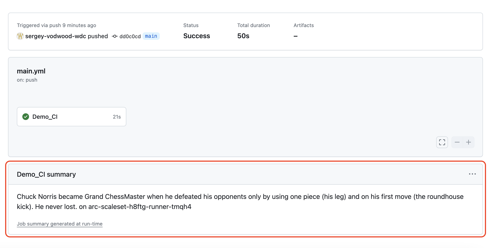

# Home Assignment - DevOps Engineer at Western Digital

Congratulations! You are now at the technical assignment stage of the interview process at Western Digital. The goal of this stage is simulate the day-to-day tasks you might be working on as a DevOps Engineer. We welcome all applicants to complete this home assignment, regardless of their past experience with specific tools, programming languages, SDK's and cloud providers. Our goal as a hiring team at Western Digital is to assess your understanding of relevant concepts and provide you, the candidate, the opportunity to showcase your skills and thought process. 

**The instructions provided in this README file alone should be sufficient to complete the assignment. Should you have any questions, feel free to contact your hiring team for clarifications.** 

## Assignment Prerequisites

To successfully complete the assignment, you must make sure to have the following:
- A free personal account with your favourite public cloud provider, e.g.: Azure, GCP, AWS, DO, Oracle or other;
- A free personal GitHub account;
- Your favourite IDE, kubectl, helm and other tools to interact with the Cloud Provider API and Kubernetes API.  

## Assignment Description

The assignment focuses on CI pipeline building skills, as well as basic cloud engineering skills and is composed of two domains:
1. Domain One. Setting up cloud infrastructure to install a self-hosted runner on Kubernetes, using [Actions Runners Controller (ARC)](https://github.com/actions/actions-runner-controller);
2. Domain Two. Debugging, fixing and successfully executing the included CI scripts on your Kubernetes-based self-hosted runner.

The purpose of the CI is to:
1. Call the [Chuck Norris Joke API](https://api.chucknorris.io/jokes/random) and retrieve a joke's text. This is handled by the **"read_cn_joke"** action;
2. Retrieve the name of the pod the workflow runs on. This is handled by the **"pod_exposer"** action;
3. Display both the joke and the pod name as a workflow summary. This is handled in the **workflow file**.

A successfull CI run indicating assignment completion will look like this:

This repository contains:
- A single GitHub **workflow file** (_".github/workflows/main.yml"_) - the yml definition of the automated CI process;
- Two GitHub actions to run as part of the workflow: **pod_exposer** ("_.github/actions/pod_exposer_") and **read_cn_joke** ("_.github/actions/read_cn_joke_");
- A **base.py** file that defines a generic class used in both actions. 

Follow the instructions below to complete each domain. The hiring team at Western Digital must be able to see your code and a successfull CI run.

**Do not push your code directly to this repository. Instead, fork this repository and submit the link back to us when done.**

## Domain One: Kubernetes in the Clouds

❗ Use Infrastructure as Code (e.g.: Terraform, Pulumi, OpenTofu, CDKs) to complete steps one, two (and optionally - three) of this domain, written below. Create a directory called "infrastructure" for your IaC code in the root of the forked repository. You don't have to apply any of it through CI.
~~~

😻 Optional to Get Bonus Points: 
- Familiar with GitOps? Use this repo to also host the definitions for the ARC components and set up the GitOps controller.
- Think about security. What basic security controls might one implement when building the infrastructure? Highlight them in your code.

~~~

1. Using your favourite cloud provider, create the required networking objects (e.g.: VPC, subnets, routing tables, IAM roles etc.; or equivalent) - to support your Kubernetes cluster;
2. Provision a basic functioning Kubernetes cluster in the cloud (e.g.: a managed Control Plane, a single Worker Node etc.);
3. Install the Action Runners Controller (ARC) with all dependencies and custom configuration (if required) on your Kubernetes cluster and connect it to your forked GitHub repository.

## Domain Two: Debugging and Executing the CI on ARC

~~~

😻 Optional to Get Bonus Points: 
- Improve the pod_exposer action to allow setting the environment variable ("POD_NAME") as a parameter in the script, instead of keeping it hardcoded.

~~~

1. Debug the CI and make changes to all of the necessary components where required (workflow and actions) to achieve a successful CI run, as described in the Assignment Description section of this document.

## Final Notes

Regardless of the outcome, we sincerely thank you for spending the time on this assignment, we hope you had fun!
Please submit the url of your public fork back to us. 
~~~
With Best Regards,
Western Digital Hiring Team 💟
~~~
